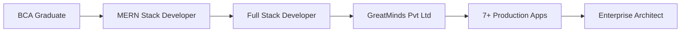

# Hi there, I'm Prabhudev Bind! 👋

<div align="center">
  
[](https://git.io/typing-svg)

[](https://linkedin.com/in/prabhudev-bind)
[](https://github.com/Devcoder980)
[](https://github.com/Devcoder980)
[](mailto:devcoder2323@gmail.com)


</div>

## 🚀 About Me

**Full Stack Developer** at **GreatMinds Pvt Ltd**, specializing in building **enterprise-grade SaaS platforms**, **mobile applications**, and **cloud-native solutions**. I architect and deliver scalable systems across web, mobile, and cloud infrastructure with expertise in **MERN**, **Flutter**, **FastAPI**, and **AWS**.

```javascript
const prabhudev = {
    currentRole: "Full Stack Developer @ GreatMinds Pvt Ltd",
    location: "Vapi, Gujarat, India",
    expertise: [
        "Multi-tenant SaaS Architecture",
        "Cross-platform Mobile Apps (Flutter)",
        "Cloud Infrastructure (AWS)",
        "Microservices & API Design",
        "Enterprise ERP/CRM Systems"
    ],
    techStack: {
        frontend: ["React.js", "Next.js", "Flutter", "Redux Toolkit"],
        backend: ["Node.js", "NestJS", "Bun", "Python FastAPI", "Express"],
        databases: ["MongoDB", "PostgreSQL", "MySQL", "Prisma ORM"],
        cloud: ["AWS (EC2, S3, RDS, Lambda)", "Docker", "CI/CD"],
        mobile: ["Flutter", "Dart", "React Native"]
    },
    education: {
        pursuing: "MCA at Andhra University (2025-2027)",
        completed: "BCA with 8.91 GPA"
    },
    achievements: [
        "99.9% system uptime across production systems",
        "40% API performance optimization",
        "85% code coverage with comprehensive testing",
        "Served 100+ concurrent users with zero downtime"
    ]
};
```

## 💼 Professional Impact

<table>
<tr>
<td>

### 🎯 Performance Metrics
- 🏗️ **99.9%** System Uptime
- ⚡ **40%** API Call Reduction
- 📈 **25%** Conversion Increase
- 🧪 **85%** Code Coverage
- 🚀 **30%** Cost Reduction

</td>
<td>

### 🌟 Business Outcomes
- 💰 Reduced infrastructure costs by **30%**
- 📊 Improved page load times: **3.2s → 1.9s**
- 🔒 **Zero security breaches** in production
- 👥 Serving **100+ concurrent users**
- 📱 Deployed **7+ production applications**

</td>
</tr>
</table>

## 🛠️ Technology Arsenal

### 💻 Frontend Development


### ⚙️ Backend Development


### 🗄️ Databases & ORMs


### ☁️ Cloud & DevOps


### 🧪 Testing & Quality


## 🏆 Featured Projects Portfolio

### 🌍 Voogyo - AI-Powered Travel CRM
> **Multi-tenant SaaS platform revolutionizing travel agency operations**

**Tech Stack:** React.js • Node.js • MongoDB • AI/ML APIs • AWS • Redux Toolkit

**Key Features:**
- 🤖 AI-driven itinerary generation and package creation
- 📊 Real-time lead management and tracking
- 🔐 Multi-tenant architecture with data isolation
- 📱 Responsive dashboard for 15+ travel agencies
- 📈 Analytics and conversion tracking

**Impact:**
- ✅ **25% conversion increase** (12% → 15%)
- ✅ **60% automation** of package creation
- ✅ **200+ leads/month** processed
- ✅ **99.9% data isolation** maintained
- ✅ **25% AWS cost reduction**

**Role:** Lead Full-Stack Developer | **Duration:** 5 months

---

### 🏭 Shantipatra OneERP - Plastic Manufacturing ERP
> **Comprehensive ERP system for plastic manufacturing with IoT integration**

**Tech Stack:** React.js • Node.js • MySQL • Prisma ORM • IoT Devices • Cypress

**Modules:**
- 📦 Inventory Management (2,000+ SKUs)
- 🏭 Production Planning & Tracking
- 🔌 IoT Device Integration (10+ devices)
- 📊 Real-time Analytics Dashboard
- 📱 Barcode Automation System

**Impact:**
- ✅ **70% workflow automation**
- ✅ **80% reduction** in manual errors
- ✅ **60% faster** data entry via barcode
- ✅ Real-time production monitoring
- ✅ Multi-unit inventory tracking

**Role:** Full-Stack Developer | **Duration:** 6 months

---

### 🏢 Smart Property Management System (PMS)
> **End-to-end property management solution for real estate portfolios**

**Tech Stack:** Flutter • Dart • NestJS • PostgreSQL • AWS S3

**Features:**
- 🏠 Property listing and management
- 💰 Rent collection and payment tracking
- 🔔 Automated payment reminders
- 📄 Lease agreement management
- 📊 Tenant and owner dashboards
- 📱 Cross-platform mobile app

**Impact:**
- ✅ Managing **50+ properties**
- ✅ **90% on-time rent collection**
- ✅ Automated reminder system
- ✅ Real-time property analytics

**Role:** Full-Stack Developer (Flutter + Backend)

---

### 👔 Cloth Rental Management System
> **Digital platform for clothing rental businesses**

**Tech Stack:** React.js • Express.js • MongoDB • Stripe Integration

**Features:**
- 👗 Catalog management with image uploads
- 📅 Booking and reservation system
- 💳 Payment gateway integration
- 📦 Inventory tracking and availability
- 🔄 Return and damage management
- 📊 Revenue analytics

**Impact:**
- ✅ **500+ items** in catalog
- ✅ **95% booking accuracy**
- ✅ Automated payment processing
- ✅ Real-time availability tracking

---

### 💰 FeeFlow - Tuition Fee Reminder System
> **Automated fee collection and reminder platform for educational institutions**

**Tech Stack:** React.js • Bun • PostgreSQL • Twilio API • WhatsApp Business API

**Features:**
- 📚 Student and course management
- 💳 Fee structure configuration
- 🔔 Automated SMS/WhatsApp reminders
- 📊 Payment tracking and receipts
- 📈 Outstanding fee reports
- 👨‍👩‍👧 Parent portal access

**Impact:**
- ✅ **1,000+ students** managed
- ✅ **40% improvement** in on-time payments
- ✅ **Automated reminder** system (SMS + WhatsApp)
- ✅ Zero manual follow-ups

---

### 🎓 Smart Attendance System
> **IoT-enabled attendance tracking with facial recognition**

**Tech Stack:** Python FastAPI • Flutter • MongoDB • TensorFlow • Raspberry Pi

**Features:**
- 📸 Facial recognition-based attendance
- 📱 Mobile app for students and staff
- 📊 Real-time attendance dashboard
- 📧 Automated parent notifications
- 📈 Attendance analytics and reports
- 🔌 IoT device integration

**Impact:**
- ✅ **99.5% recognition accuracy**
- ✅ **500+ students** enrolled
- ✅ Real-time parent notifications
- ✅ **80% time savings** vs manual attendance

---

### 💼 Enterprise CRM Platform
> **Customer relationship management for B2B sales teams**

**Tech Stack:** Next.js • NestJS • PostgreSQL • Redis • AWS Lambda

**Features:**
- 👥 Lead and contact management
- 🔄 Sales pipeline tracking
- 📧 Email campaign automation
- 📊 Sales analytics and forecasting
- 🤝 Team collaboration tools
- 📱 Mobile-responsive interface

**Impact:**
- ✅ **30% increase** in sales productivity
- ✅ Managing **5,000+ leads**
- ✅ Automated follow-up system
- ✅ Real-time sales insights

---

## 📊 GitHub Statistics

<div align="center">


</div>

## 🎯 Technical Expertise

```
┌──────────────────────────────────────────────────────────────────┐
│                                                                  │
│  Frontend Development      ████████████████████░  95%          │
│  Backend Architecture      █████████████████████  98%          │
│  Mobile Development        ████████████████░░░░░  80%          │
│  Cloud & DevOps           ██████████████████░░░  90%          │
│  Database Design          █████████████████████  97%          │
│  API Development          █████████████████████  99%          │
│  System Architecture      ████████████████████░  92%          │
│  Testing & QA             ████████████████░░░░░  85%          │
│                                                                  │
└──────────────────────────────────────────────────────────────────┘
```

## 🎓 Education & Certifications

### 🎓 Education
- **Master of Computer Applications (MCA)** - Andhra University Online (2025-2027) - *In Progress*
- **Bachelor of Computer Applications (BCA)** - ROFEL College, Vapi - **8.91/10 GPA**

### 🏅 Certifications
- ✅ **React** - HackerRank (Nov 2023)
- ✅ **SQL (Intermediate)** - HackerRank (Nov 2023)
- ✅ **Software Engineer** - HackerRank (Nov 2023)
- ✅ **Frontend Development** - Devsnest (Dec 2022)
- ✅ **Machine Learning using Python** - Great Learning (Dec 2022)

## 💡 Core Competencies

<table>
<tr>
<td width="50%">

### 🏗️ Architecture & Design
- Multi-tenant SaaS Architecture
- Microservices Design Patterns
- RESTful & GraphQL API Design
- Database Schema Optimization
- Cloud-Native Architecture

</td>
<td width="50%">

### 🚀 Development Practices
- Agile/Scrum Methodology
- Test-Driven Development (TDD)
- CI/CD Pipeline Implementation
- Code Review & Quality Assurance
- Performance Optimization

</td>
</tr>
<tr>
<td width="50%">

### ☁️ Cloud & Infrastructure
- AWS (EC2, S3, RDS, Lambda)
- Docker Containerization
- Load Balancing & Auto-scaling
- Infrastructure as Code
- Monitoring & Logging

</td>
<td width="50%">

### 📱 Mobile Development
- Flutter Cross-platform Apps
- Responsive UI/UX Design
- State Management (Provider, Bloc)
- Native Platform Integration
- App Store Deployment

</td>
</tr>
</table>

## 🌟 What I'm Currently Focused On

- 🔭 Building **enterprise SaaS solutions** at **GreatMinds Pvt Ltd**
- 🌱 Mastering **serverless architecture** with AWS Lambda
- 👯 Exploring **GraphQL** and **real-time communication** (WebSockets)
- 🚀 Contributing to **open-source projects**
- 📱 Developing **production-grade Flutter applications**
- 💬 Ask me about **React optimization**, **NestJS**, **Flutter**, or **AWS deployment**

## 📈 Professional Journey



## 🤝 Let's Connect & Collaborate

I'm always interested in discussing:
- 💼 **Full-time opportunities** in SaaS and cloud-based platforms
- 🚀 **Innovative projects** involving modern web/mobile technologies
- 🤝 **Open-source collaborations** and tech community engagement
- 💡 **Consulting** on architecture and scalability challenges

### 📫 Reach Me At:

<div align="center">

[](https://linkedin.com/in/prabhudev-bind)
[](mailto:devcoder2323@gmail.com)
[](https://twitter.com/BindPrabhudevJK)
[](https://github.com/Devcoder980)

</div>

---

<div align="center">

### 💭 Developer Philosophy

*"Clean code is not written by following a set of rules. You don't become a software craftsman by learning a list of what to do and what not to do. Professionalism and craftsmanship come from values that drive disciplines."*

**~ Robert C. Martin**

---

### 🎯 Current Status: Open to Opportunities | Building at GreatMinds Pvt Ltd

**⭐ Star my repos if you find them helpful!**


**📊 Profile Analytics**


</div>
